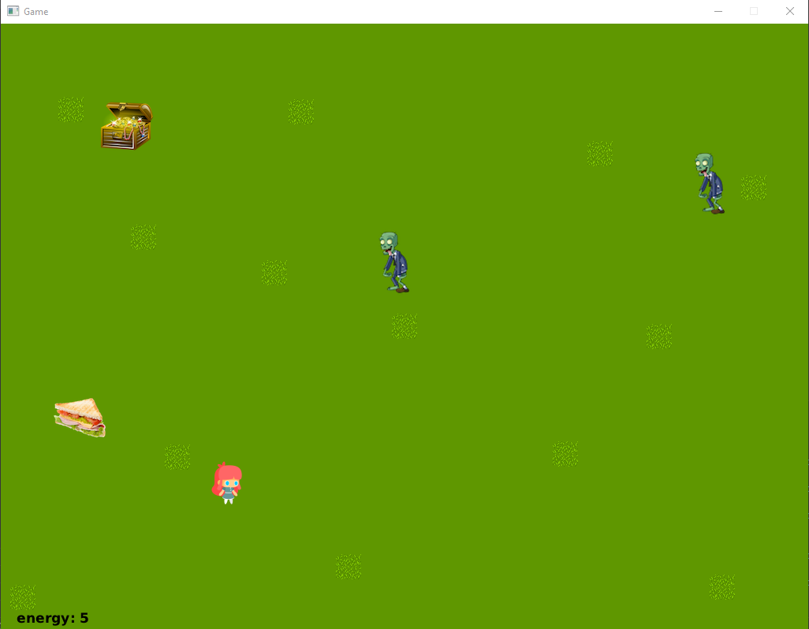

# ShadowTreasure
This game is built using Bagel + Java and pits a player character against zombies in a fight to reach the end goal, the treasure.  
The player can shoot zombies but this costs energy to do so, which the player can replenish by eating sandwiches found around the environment.  
The environment can be altered in the environment files and the player will attempt to complete the level by killing all zombies and touching the treasure.  
 
